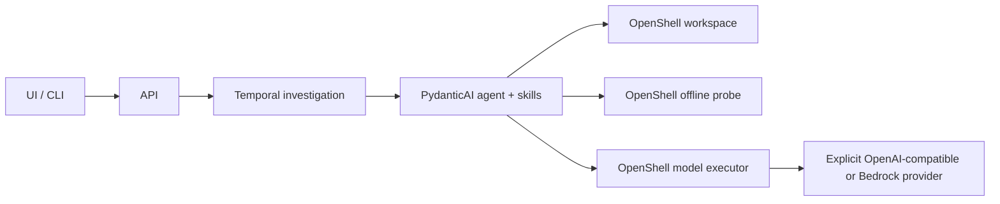

# InfoSec Harness

Investigate a reported vulnerability with a tool-using PydanticAI agent, run experiments
inside OpenShell, and retain the investigation in Temporal. A small React UI submits
findings and displays the resulting evidence.

The investigator chooses how to explore, install dependencies, construct experiments and
interpret results. Language, environment and vulnerability expertise lives in packaged
skills. Python code enforces contracts, budgets, isolation and evidence requirements.
There is one execution path and no application database or custom inference broker.



## Development

Pins are recorded in `.mise.toml` and `.dev-tools/`. On macOS Apple Silicon or Linux x86-64:

```bash
./dev --profile offline        # pinned tools and deterministic checks, including local Temporal
./dev                         # managed control plane and configured native OpenShell checks
./dev worker                  # run the trusted Temporal worker
./dev status
./dev logs
./dev stop                    # preserve VM, configuration and data
```

Full mode requires the native runtime described in [OpenShell setup](deploy/openshell/README.md).
It fails if that boundary cannot be demonstrated. It does not silently substitute Docker,
a stub agent or a public model. The checkout-managed Linux VM and isolated image builder
are provisioning infrastructure; investigation commands always go through OpenShell. A full
evaluation cohort exceeds the pinned gateway's admission quota and needs the
[patched gateway](deploy/openshell/README.md#patched-gateway-build).

Set operator configuration in the worker environment. No provider credentials belong in
that environment: provision them in OpenShell's model profile.

```bash
export HARNESS_OPENSHELL_CONFIG=/absolute/path/to/runtime.json
export HARNESS_MODEL_PROVIDER=openai
export HARNESS_MODEL_BASE_URL=https://your-model-host/v1
export HARNESS_MODEL_NAME=Qwen3.6-35B-A3B-NVFP4
export HARNESS_LOCAL_REPO_ROOTS='["/absolute/path/to/approved/repositories"]'
./dev worker
```

Budgets come from `Limits` (defaults: 300,000 tokens, 30 model requests, 120 s per command),
for example `HARNESS_LIMITS__TOTAL_TOKENS=600000`. To freeze one exact configuration, pass
`--settings FILE`: a JSON document of `Settings` fields, including nested `limits`, that is
used instead of every `HARNESS_*` variable, so it must also name the Temporal address:

```json
{
  "temporal_address": "127.0.0.1:<temporal-port>",
  "openshell_config": "/absolute/path/to/runtime.json",
  "model_base_url": "https://your-model-host/v1",
  "local_repo_roots": ["/absolute/path/to/infosec-harness/eval-corpus"],
  "limits": {"total_tokens": 600000, "max_requests": 40, "command_timeout_seconds": 300}
}
```

A `command_timeout_seconds` above the runtime's `max_timeout_seconds` (default 300) is capped
for model requests but makes every tool command fail, so keep it within that maximum.

The model name must match the endpoint's served identifier. The self-hosted model is not
provisioned or downloaded by this repository. A Bedrock executor is included, but its native credential-profile integration is not yet
qualified; do not treat the provider option as working execution evidence.

The API binds loopback by default. It has no authentication layer: deploy it behind an
authenticated service boundary before exposing it to other users. Local repository roots
are an explicit allowlist; remote repository inputs accept HTTPS Git URLs without embedded
credentials. Snapshots reject symlinks and special files rather than copying material
outside the approved source tree.

## Submit and inspect

```json
{
  "title": "Potential command injection",
  "description": "Explain the reported input, entry point and suspected sensitive operation.",
  "repo_url": "https://example.org/team/repository.git",
  "revision": "reviewed-commit",
  "file_path": "src/handler.py",
  "cwe": "CWE-78"
}
```

```bash
uv run --locked harness submit finding.json
uv run --locked harness report investigate-v11-<id>
```

For a local uncommitted fixture, use `source_mode: working_snapshot` and `revision: HEAD`.
The worker captures an immutable source snapshot before invoking the model.
The API exposes `/api/runs`, `/api/runs/{id}`, cancellation and `/api/health`.
Health proves control-plane connectivity only; it does not qualify sandbox or model execution.

## Checks and evaluation

```bash
just check
just test
just test-network
just generated-check          # API schema, CLAUDE.md and copied development skills
just ui-check
./dev qualify                 # native boundaries, no model calls
./dev eval                    # live corpus with an owned worker on a fresh task queue
./dev eval --case NAME        # one-case diagnostic; never qualifies
./dev replay RUN_ID           # zero-dispatch history replay
```

Evaluation uses the unchanged paired corpus and packaged release policy. It requires a
clean source identity, the native runtime and model endpoint; `--settings FILE`, accepted
anywhere among a `./dev` verb's arguments, pins one exact configuration. Each qualify and
eval report gets a new timestamped path under `.harness/reports/`; failures and unstarted
cases remain visible. See
[OpenShell setup](deploy/openshell/README.md#qualification-and-evaluation) for draining an
interrupted owned worker and `--keep-going`. Live runs consume inference
resources and never happen as part of ordinary setup or deterministic tests.

A definitive verdict requires source citations and a successful, complete offline probe
whose original source files remain unchanged, with explicit target and control observations.
Those observations are model-authored claims, not independent semantic attestation. Unknown
command delivery, missing controls, truncation, failure or contradictory evidence must not
be reported as a verified negative result. A contrary probe can be set aside only when it
is older than the newest cited probe and the summary explains its flaw. A command killed at
its budget inside the sandbox is a complete exit-137 result; the gateway's own exit 124 stays
unknown. See [architecture and boundaries](docs/architecture/TRIAGE_SYSTEM.md).

The current workflow generation uses the `investigate-v11` queue. It binds every native
model/tool activity to the captured worker identity. v10 and older histories and workers
are incompatible; drain them before deployment. Historical reports do not qualify this candidate.
