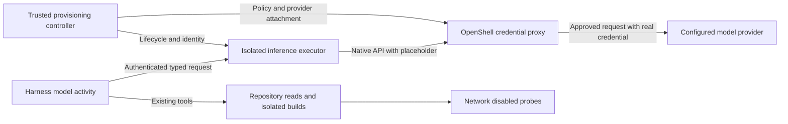

# Harness credential brokering specification

Status: Implemented opt-in contracts; corrected-topology G0 passed; bounded native/service qualification passed; rollout disabled
Date: 2026-10-01
Specification version: 0.2.5

The October local-provider qualification and retained failures are recorded in [live-provider evidence](validation/CREDENTIAL_BROKER_LIVE_PROVIDER.md). Admission behavior changed without changing wire protocol v1; deploy the new immutable executor contract and drain prior allocations before adoption.

Execution sequencing and delegated work are defined in the [implementation and testing plan](architecture/CREDENTIAL_BROKER_IMPLEMENTATION_PLAN.md).

This proposal removes reusable provider credentials from harness model callers and establishes a controlled path for future private repository and dependency access. The first milestone uses an isolated inference executor with OpenShell managing endpoint-bound credential substitution. Temporal, PydanticAI, repository tools, build isolation, and network-disabled probes retain their existing responsibilities.

MUST, SHOULD, and MAY describe proposed requirements, not verified behavior. This document supplements [the harness evolution specification](architecture/HARNESS_EVOLUTION_SPEC.md) and [the existing redesign](architecture/SPEC.md). It does not authorize widening execution permissions or claim integration acceptance.

## Baseline and scope

The source review used checkout HEAD `1fdef7d7d20485346cdb9a59d0b49fc38ee196a3` plus the working tree on 2026-10-01. Existing uncommitted changes were present, including model configuration, eval, setup, and deployment work. Implementation MUST recheck those interfaces before editing. Source presence does not establish runtime enforcement.

Current integration points are:

- `src/infosec_harness/agents/models.py`: backend configuration, effective model identity, provider construction, and transport retries. OpenAI-compatible clients read API keys on the worker; Bedrock uses the AWS credential chain.
- `src/infosec_harness/agents/registry.py`: model resolution and PydanticAI Temporal model activities. Production and eval transport contracts already distinguish durability from retry selection.
- `src/infosec_harness/repo/checkout.py`: Git subprocesses inherit the worker environment.
- `src/infosec_harness/sandbox/docker.py` and `deploy/squid-allowlist.conf`: gVisor execution and build egress through a destination allowlist. Probe execution disables networking.
- `src/infosec_harness/graph/manifests.py`: environment provenance omits credential values.

The first deliverable covers one OpenAI-compatible inference backend in both local and Temporal execution. Bedrock signing, private HTTPS Git checkout, and private package registries are separate milestones. Native SSH credential forwarding, production target access, enterprise tenancy, and general API execution are outside this proposal. Existing direct backends remain explicitly selectable during migration, but MUST never serve as an automatic fallback from brokered mode.

## Upstream capability assumptions

OpenShell documentation reviewed on 2026-10-01 identifies latest as v0.1.2. Implementation MUST pin a reviewed release, SDK version, and image digests; this date and version are research context, not a deployment pin.

OpenShell documents opaque credential placeholders, endpoint binding, and fail-closed resolution. Rotation requires attention to process lifetime: existing processes retain revision-scoped references, and readiness does not test backend access or cancel requests already sent. These behaviors need live verification for the pinned release. [Providers](https://docs.nvidia.com/openshell/latest/how-it-works/providers/overview)

Inference uses native provider APIs inside managed sandboxes; client code selects the model and timeout. The proposed harness executor described below is new harness code, not an existing OpenShell inference service. [Inference](https://docs.nvidia.com/openshell/latest/how-it-works/inference)

OpenShell documents network confinement, credential substitution, and request inspection. Request rules default to audit mode, so this integration MUST set enforce explicitly. TLS inspection requires trusted CA configuration. Its binary identity policy is useful defense in depth, but allowing Python does not distinguish trusted application code from hostile code running in that interpreter. [Security controls](https://docs.nvidia.com/openshell/latest/security/best-practices)

OpenShell supports several compute drivers. The pinned supervisor failed actual Landlock qualification under the original runsc daemon. A separate checkout-owned daemon with a native OpenShell boundary passed the bounded feasibility proof; see [the deployment revision](architecture/OPENSHELL_DEPLOYMENT_REVISION.md) and [qualification evidence](validation/OPENSHELL_FEASIBILITY.md). This establishes feasibility, not production acceptance. Use the checkout-owned Linux environment for experiments; do not change global Docker contexts or weaken our sandbox checks to make it run. [Sandbox runtimes](https://docs.nvidia.com/openshell/latest/how-it-works/sandboxes/runtimes)

## Security boundary and authority

Protect provider credentials and refresh material, source confidentiality, model budgets, broker administration, and provenance. Treat findings, repository files, prompts, tool output, model responses, and workload-produced policy claims as untrusted.

The broker reduces credential exposure; approved inference endpoints still receive source-bearing prompts. Endpoint access can also incur spend or invoke unintended provider operations. Provider-side restrictions and harness budgets remain necessary. A malicious operator or compromised broker control plane can grant access; neither is addressed by hiding tokens from the caller.

| Component | Permitted authority | Prohibited authority |
| --- | --- | --- |
| Trusted provisioning controller | Create narrowly scoped executor instances; attach an operator-selected provider; verify effective policy; revoke and clean up | Accept policy, provider, or mount choices from model output |
| Harness worker | Submit bounded model requests to its authorized executor; retain normal workflow and repository tools | Hold real upstream credentials for a brokered backend; administer OpenShell using workload input |
| Inference executor | Invoke its configured provider and return typed model responses | Execute tools, import repository code, evaluate prompt text, choose arbitrary URLs, access worker storage, Temporal, or Docker sockets |
| OpenShell supervisor and credential proxy | Apply policy and substitute credentials | Delegate administration to the executor |
| Build or checkout workload in later milestones | Read narrowly scoped source or dependency endpoints | Receive model, artifact-storage, or orchestration credentials |
| Probe workload | Existing isolated exploit and runner execution | Receive any provider attachment or external network route |

Provisioning credentials and upstream secrets MUST stay outside model activity payloads, workflow history, prompts, diagnostics, and repository images. Workload identities and placeholders are sensitive capabilities even if they are not reusable upstream secrets; they MUST also be excluded from these durable surfaces.

## Proposed request architecture

A custom PydanticAI model transport MUST forward only model requests to the executor. Existing tool execution and output validation stay on the worker. This preserves the Temporal model activity boundary and avoids moving the entire worker, its orchestration credentials, or its Docker access into an OpenShell sandbox.

The executor MUST be a minimal service built from a pinned image, with no repository mounts, agent skills, shell tools, dynamic plugins, or privileged sockets. It MUST reject unknown request fields, unsupported content types, oversize payloads, arbitrary headers, URLs, provider names, and models outside its configured contract. Tool definitions are serialized data; returned tool calls are validated and handled by the existing agent machinery.

The worker-to-executor channel MUST authenticate the worker using a separate deployment identity and restrict access to the executor and backend that identity may use. TLS or an equivalently authenticated local channel is required. Authentication MUST be resolved outside workflow inputs. Admission MUST verify request limits against a trusted reservation, rather than accepting a caller-supplied budget as authority. The controller issues this reservation outside workflow replay; only its nonsecret identity and limits may be persisted. The executor MUST not have access to this channel's issuer or OpenShell administration APIs.

For the initial implementation, an executor instance MUST serve one immutable backend and access profile contract and one run at a time. Agents in that run MAY share an executor only when their complete resolved executor contracts are identical, including model admission, policy, image, provider attachment, and middleware requirements. Invocation budgets and request ledger ownership remain separate. Different contracts require separate sandboxes; a request's agent label cannot switch a sandbox's policy. Provision instances lazily and do not preallocate one sandbox per agent. Cross-run pooling requires a separate isolation and accounting review. The controller MUST terminate orphaned instances using a bounded lease and reconciliation loop.

The inbound service transport and instance lifecycle APIs are feasibility gates. A managed sandbox MUST expose only the authenticated inference service through an operator-controlled path. If the pinned OpenShell deployment cannot provide this without exposing administrative access, weakening confinement, or introducing forbidden sockets, stop that adapter milestone and document the incompatibility. A separate credential broker MAY be proposed against the same acceptance requirements; it is not an automatic downgrade.

## Model transport contract

The implemented internal protocol is `ih-inference-v1`; [the frozen protocol](architecture/CREDENTIAL_BROKER_PROTOCOL.md) and `inference/protocol.py` define its wire contract. It MUST round-trip the supported PydanticAI message and response types without lossy text conversion. The initial milestone supports non-streaming requests; unsupported streaming MUST be rejected explicitly.

| Direction | Required fields |
| --- | --- |
| Worker request | Protocol version; logical request ID; registered agent name; access profile identity; stable scheduling identity (attempt excluded); payload digest; immutable model contract digest; trusted reservation reference; remaining deadline; typed messages; tool and output schemas; effective model settings |
| Executor response | Logical request ID; payload digest; contract digest; structured model response; observed usage; provider request ID when available; attempt disposition; actual policy and image identity |
| Failure | Stable error class; request ID; phase; whether dispatch occurred; whether upstream completion is unknown; sanitized reason |

Endpoint, provider attachment, TLS configuration, credentials, and upstream authorization headers are deployment configuration, not request fields. Multimodal URLs that would cause an executor to fetch external content MUST be rejected initially; inline supported content remains subject to size and type limits.

Existing message merging, output-token floors, structured output, model selection, token accounting, and pricing behavior MUST remain equivalent across direct and brokered transport. Each adaptation MUST run exactly once. The executor owns native client construction; the worker's resolved contract describes the effective settings actually used and MUST be checked against the executor before dispatch.

The first milestone MUST use zero automatic executor-to-provider retries. Temporal or the existing local caller owns bounded retry policy. Any later transport retry allowance MUST be included in the existing total request envelope and provenance; adding a new retry layer without accounting is prohibited. Harness reservation limits MUST cap real dispatch attempts, including attempts whose usage is unknown.

## Endpoint policy and credential lifecycle

All access policies MUST be operator-owned, schema-validated, immutable for the life of an executor, and inspected after provider policy composition. Effective rules MUST authorize only the exact provider hosts, ports, API paths, methods, and trusted executable identities needed by the backend. Provider profile examples are starting material, not accepted defaults.

Brokered mode MUST require request enforcement, deny direct egress, block metadata and undeclared internal destinations, and reject TLS bypass or uninspected credential exceptions. Redirects MUST be disabled initially. Host authority and credential destination matching MUST be checked on every request; alternate hosts, alternate ports, IP literals, and path normalization tricks must not widen authorization. TLS interception MUST preserve upstream certificate verification. Unsupported trust stores or certificate pinning are compatibility failures, not reasons to disable verification.

Upstream credentials MUST be dedicated to the required service, use short expiry where supported, and have provider-side quotas or spend limits. Runtime setup MUST explicitly select provider attachments and avoid ambient credential discovery. The gateway's secret storage, encryption or equivalent access protection, backup handling, file permissions, and admin authentication MUST be assessed before live acceptance. Broker logs MUST omit request bodies and authorization material by default.

Rotation MUST stop admitting requests to the old executor, wait for the provider change acknowledgement, launch a new process with the new reference, verify the new contract, and resume admission. Do not assume an existing process has adopted a new credential. Revocation MUST block new admission immediately and detach the provider with acknowledgement; destroy the executor when acknowledgement cannot be established. In-flight provider requests may finish or remain unknown, and revocation MUST not be reported as upstream cancellation.

## Nested request deadlines

The provider call has a 90-second total wall deadline, independent of SDK timeout settings
and HTTP inactivity. Ledger hops allow 30 seconds each. Native preparation allows 90 seconds;
the executor hop allows 150 seconds, the controller request allows 285 seconds, and bounded
reconciliation allows another 45 seconds. The HTTP server allows 345 seconds and the worker
allows 360 seconds, below the existing 600-second model activity ceiling. Admission and
provider execution remain capped by the binding expiry. Read-only saved-result recovery may
continue after expiry without granting fresh dispatch authority.

Timeout or cancellation MUST durably fence an accepted request before slow native cleanup.
A concurrent claim MUST be reconciled as uncertain unless a completed result is already saved.
Cleanup MUST remain bounded and preserve uncertain budget holds. If ledger availability
prevents corroborating the fence, the controller MUST report unavailability and retain
allocations for explicit recovery; response expiry is not proof of upstream cancellation.
Transport diagnostics MUST
contain only fixed boundary and failure categories, with no exception text, endpoints,
headers, credentials or model payloads. These timing changes require fresh executor images and
full-contract identities; the wire protocol and durable workflow payloads remain unchanged.

## Failure and durable recovery contract

| Condition | Required behavior |
| --- | --- |
| Missing provider, expired reference, denied endpoint, policy mismatch, invalid request | Typed non-retryable failure; no direct fallback; preserve failure evidence |
| Controller or executor unavailable before dispatch | Bounded infrastructure retry within the remaining deadline and budget |
| Timeout or disconnect after dispatch | Record unknown upstream completion and potential spend; reconcile before another dispatch |
| Worker crash after executor saved response | Recover the same response by logical request ID and payload digest |
| Same request ID with a different payload or contract | Reject as an identity conflict |
| Workflow cancellation | Stop admission; cancel transport; reconcile dispatch disposition; revoke the run lease and clean up |
| Credential rotation or expiry during recovery | Acquire fresh access only under the same policy and backend contract; otherwise stop for explicit migration |

The executor MUST maintain an access-controlled durable request ledger outside workflow history. Admission uses an atomic uniqueness constraint or equivalent compare-and-set keyed by deployment identity and logical request ID. A duplicate request attaches to the existing operation; it must not dispatch concurrently. Before forwarding, persist a dispatch-intent record. After completion, persist the structured response and usage before acknowledging the worker. Ledger storage is a trusted controller-managed resource, not a worker filesystem mount or general database credential in the workload; its narrow service API MUST restrict records to the executor's run.

Ledger states are `accepted`, `dispatch_intent`, `completed`, `failed_before_dispatch`, and `completion_unknown`. A crash between forwarding and response persistence cannot establish exactly-once provider execution. Without supported provider idempotency or reconciliation evidence, a `dispatch_intent` with no result MUST become `completion_unknown` and MUST not automatically dispatch again. A new charged attempt requires an explicitly authorized recovery decision and a fresh reservation within the root ceiling. No missing result may become an exploitability verdict.

Temporal replay MUST consume completed activity results without acquiring credentials, creating executors, reading policy files, or contacting the ledger inside workflow code. New or retried activities resolve current runtime access on the worker. Stable request IDs MUST distinguish workflow execution, agent invocation, model request ordinal, and explicit replacement attempts; do not derive identity from prompt text alone. Local execution MUST use the same protocol and accounting rules with a controller-generated run identity.

The controller MUST persist lease ownership and reconcile instances after its own restart. Cleanup MUST be idempotent, scoped by deployment and run labels, and bounded; cancellation and cleanup cannot delete another checkout's sandbox. Request ledger retention MUST last through the supported workflow recovery window. An expired recovery record MUST produce an explicit recovery failure, not a silent fresh dispatch. Source-bearing stored responses require the same access and retention protections as existing harness artifacts.

## Configuration and provenance changes

Extend the backend model with a proposed `transport` selector (`direct` or `brokered`), an operator-owned broker binding, and an expected immutable access contract digest. Defaulting existing configurations to direct preserves compatibility; selecting brokered MUST reject direct credential configuration and refuse startup if its required contract cannot be established. Broker channel authentication is configured by deployment identity, not by secret YAML values.

## Agent access profiles

Each harness agent MUST resolve to a named access profile through an operator-owned mapping. Start with one shared `inference-only` profile for all eleven registered agents: `intake`, `recon`, `env-planner`, `build-repair`, `partial-build`, `context`, `probe-planner`, `probe-author`, `probe-diagnosis`, `probe-repair`, and `verdict`. This profile permits only the selected model endpoint and the narrowly scoped service channels required by the executor. It grants no repository, registry, or general API access. A different backend may produce a different resolved contract from the same profile template.

The initial implementation needs a small validated catalog and explicit agent-to-profile bindings, not a policy inheritance engine, custom plugin framework, or separate service deployment for every agent. A future distinct policy for `verdict`, for example, changes its mapping to a new named profile; other agents keep their existing bindings. Unknown agents, missing mappings, unknown profiles, and incompatible backend/profile combinations MUST fail configuration validation. No wildcard grants or implicit broad fallback are permitted. The existing registered agent list is the source of truth for mapping completeness.

OpenShell policies apply to sandboxes. A logical agent name in a shared Python worker is not an independent OpenShell security principal. In this architecture, per-agent profiles govern the agent's model request executor; repository reads and shell tools remain governed by existing harness capabilities and sandbox checks. Even a build-repair agent's inference executor receives no registry access. Later checkout or build credentials belong to separately isolated workloads. Claiming OpenShell enforcement of all agent operations would require moving those operations into their own managed boundaries and separately validating that design. [Sandbox policies](https://docs.nvidia.com/openshell/latest/how-it-works/policies/overview)

The worker MUST resolve agent identity from the registered invocation, never from prompts or tool output. The controller MUST bind the run, agent, selected profile, and immutable contract digest to its trusted reservation; executor admission MUST verify that binding. A caller-supplied `agent_name` or profile selector alone grants no authority. Agents sharing one profile still receive distinct invocation accounting. This prevents workload text from selecting a broader profile; it does not claim isolation between logical agents after compromise of their shared trusted worker.

The proposed request envelope adds the registered agent name and selected access profile identity. Persist their mapping revision and resolved digest in the effective agent configuration. Local execution, evals, and Temporal activities MUST use the same resolution path. Policy changes require a new resolved contract and a new executor; do not mutate policy between calls or union two agents' permissions to enable sharing.

Do not use OpenShell's global policy as an intersecting maximum boundary: upstream documents that it replaces sandbox policies. Provider attachments may also contribute rules. Inspect and verify the effective policy against the expected profile after composition and global policy selection. An unexpected global override MUST fail readiness. Automatic policy expansion remains disabled. [Policy selection and composition](https://docs.nvidia.com/openshell/latest/how-it-works/policies/overview)

## Future credential and inspection extensions

Keep these extensions as deployment configuration using OpenShell's native mechanisms. The harness transport MUST depend on a logical provider binding and a resolved access contract, not on the secret storage implementation. The first milestone uses one reviewed built-in credential driver; implementing Vault integration, a custom credential driver, or a general secret-provider abstraction is deferred.

OpenShell documents database, Kubernetes Secret, and Vault-compatible credential drivers that keep provider credentials behind opaque handles. A future storage migration SHOULD retain the logical provider binding so agents and model transport need no changes. Driver selection and authentication belong to the trusted gateway deployment. The controller may record nonsecret driver implementation and protocol versions as operational provenance, but secret-store handles and authentication material MUST not enter agent config or workflow history. Driver replacement requires attachment, rotation, revocation, and recovery conformance checks; equivalent storage changes alone need not alter the model behavior contract. [Credential drivers](https://docs.nvidia.com/openshell/latest/extensibility/drivers)

Each access profile SHOULD support an optional ordered list of operator-owned OpenShell middleware bindings, empty initially. Use native middleware configuration and protocol negotiation when inspection is introduced; do not implement an unused content-inspection service, harness middleware bus, or placeholder callbacks now. Required middleware identity, version, configuration digest, order, and failure behavior MUST become part of the immutable access and behavior contract. Inspection configured as required MUST block traffic if unavailable, unsupported, or skipped; an empty list means inspection is disabled and MUST be reported as such.

OpenShell request middleware runs after network policy checks and before provider credential injection. Content inspection may reject or transform traffic but cannot replace endpoint authorization or tool confinement. Prefer narrowly scoped rejection initially: silently redacting vulnerability source or probe payloads could change triage conclusions. Inspection coverage, source confidentiality, false positives, response handling, and model behavior need separate evaluation before rollout. Upstream documents inspection gaps for some response bodies and transports; those paths cannot be accepted when a profile requires inspection. [Supervisor middleware](https://docs.nvidia.com/openshell/latest/extensibility/supervisor-middleware)

Adding inspection requires a new contract and executor deployment; disabling required inspection is an explicit contract change, never a fallback. No inspection requirement, middleware service, credential-driver extension service, policy advisor workflow, or gateway interceptor is required for the initial milestone. Preserve only the configuration seams, ownership boundaries, and provenance fields needed to add them later.

## Version and runtime provenance

The effective model contract MUST record transport kind, protocol version, executor image digest, OpenShell release and supervisor identity, effective policy digest, provider profile digest, nonsecret provider revision, endpoint, retry ownership, and contract verification status. Credential values, placeholders, client certificates, tokens, and secret-derived hashes MUST be excluded. Distinguish requested identity from runtime-observed identity. A configured provider name or ready attachment alone is insufficient evidence of backend use.

Per-request evidence MUST identify actual policy and credential revision used, dispatch disposition, request count, observed usage, and unknown spend. The controller MUST corroborate executor identity and effective policy against the trusted control plane; executor response fields alone cannot establish enforcement. Credential-only rotation changes operational provenance but MUST not by itself make model behavior incomparable; policy, request shaping, retries, transport, or model changes do. Unknown usage MUST remain unknown and receive conservative reservation accounting.

Keep the immutable access and behavior contract digest separate from operational revision metadata. The former covers policy, endpoint, model settings, protocol, image, and retry behavior; it excludes secret values and credential rotation revisions. A credential-only rotation may therefore renew access under the same contract while recording the new nonsecret revision. An OpenShell version or executor image change requires a new contract and conformance evidence.

This implementation requires a new version of the model transport and effective configuration contract. Update canonical sources for affected governance and generated schemas; do not edit generated output directly. Introduce an additive persistence migration if new fields need storage. Historical records lacking transport evidence MUST remain marked legacy or unverified. Workflow changes MUST use the repository's supported Temporal compatibility mechanism and replay fixtures; active histories cannot silently switch transport or policy on replay.

## Later access milestones

Private HTTPS checkout MUST run in a separate credentialed workload with only read access to approved repositories. Use an explicit minimal environment, no ambient SSH agent or host Git credential helpers, and controlled Git configuration. Verify the requested revision and export a bounded immutable snapshot; exclude Git metadata and credential material. Existing path, symlink, file-count, and size checks still apply. Checkout access MUST not imply GitHub API write or package publishing access.

Private dependency builds MUST broker credentials only for required registry download operations and approved package scopes where enforceable. Package installer hooks remain hostile; executable identity alone cannot distinguish installer code from its hooks. Registry-side read-only tokens and request policy must carry that boundary. Dependencies MUST become available without secret files, real credential build arguments, image-layer leakage, or credential-bearing recipe caches. Existing gVisor build execution and direct-egress prevention MUST pass unchanged. OpenShell and BuildKit compatibility is a separate feasibility gate; wrapping a build command does not establish containment of its RUN processes.

Bedrock adoption requires live SigV4 re-signing, temporary-role scope, credential refresh, SDK trust-store compatibility, native request and response parity, and usage accounting evidence. Availability of an AWS provider profile is insufficient. Until then, Bedrock direct mode remains a separately labeled configuration and is not part of brokered acceptance.

## Implementation work packages

| Package | Deliverable and exit condition |
| --- | --- |
| Feasibility | Pin upstream artifacts; demonstrate an authenticated executor service and controller lifecycle; test required isolation and TLS behavior; record incompatibilities before modifying production dispatch |
| Transport | Add typed protocol, strict admission, PydanticAI model adapter, effective contract checks, and non-streaming parity fixtures |
| Durability | Add request ledger, lease reconciliation, error mapping, cancellation, recovery tests, and total attempt accounting |
| Deployment | Add an opt-in checkout-owned setup profile and pinned tools; configure secret storage, controller and workload identities, explicit attachments, enforce policy, and health fixtures |
| Acceptance | Run deterministic, live security, provider, parity, and recovery gates; publish evidence with per-gate status |
| Extensions | Specify and accept HTTPS checkout, registry builds, and Bedrock individually against their additional boundaries |

Expected code areas include `agents/models.py`, a new inference transport/executor package under `src/infosec_harness/`, activity integration in `agents/registry.py`, model provenance and persistence, setup scripts, and deployment configuration. Exact module names are implementation choices. Build and probe modules MUST not be refactored merely to introduce the model transport.

## Acceptance cases and evidence

These are required future tests with independent security expectations, not existing passing tests.

| Gate | Required evidence |
| --- | --- |
| Credential exposure | Canary upstream secret absent from worker and executor environments, prompts, exception text, logs, tracing, Temporal history, ledgers, image layers, and artifacts; capture at the mock upstream proves substitution occurred |
| Endpoint authorization | Valid request succeeds; wrong host, port, path, method, authority, redirect, expired placeholder, malformed placeholder, and unattached provider fail without an upstream authorized request |
| Egress confinement | Raw sockets, clients ignoring proxy variables, IPv4 and IPv6, metadata, internal destinations, and DNS changes cannot bypass the approved route |
| Administration | Unauthorized worker, other run identity, hostile provider selector, mount request, arbitrary URL, and attempted gateway administration are denied |
| Policy enforcement | Effective composed policy matches the expected digest; audit mode, TLS bypass, broadened profile, and stale policy fail readiness |
| Agent profile binding | Every registered agent has a valid mapping; forged agent/profile fields, cross-profile reservations, missing mappings, and unexpected global overrides fail; different contracts never share an executor or gain the union of permissions |
| Future extension configuration | Empty middleware bindings report disabled inspection; unknown or requested-but-unsupported extension bindings fail validation; the transport does not require secret-store implementation details |
| Model behavior | Fixture parity for tool calls, structured output, errors, usage, caching fields, message adaptation, and token floor; live response evidence from one supported backend |
| Budget and retries | Real upstream dispatch count stays within reservation and root ceiling; retries do not multiply invisibly; unknown completion reserves possible spend |
| Recovery | Crashes at every ledger transition, lost acknowledgements, duplicate calls, controller restart, expiry, rotation, cancellation, and revoked credentials satisfy the recovery table |
| Isolation regression | Existing runsc execution and build-egress fixtures pass; probes remain network-disabled and credential-free |
| Provenance | Claimed policy, image, backend, protocol, and credential revision match runtime observations; legacy records cannot be upgraded by configuration alone |
| Evaluation | Direct and brokered transports use identical effective model settings and bounded request contracts; held-out quality and budget gates are not relaxed |

Report median and p95 added latency, executor startup time, resource use, ledger overhead, and additional billed requests against the direct baseline. Set rollout performance limits before inspecting candidate results; retain existing quality thresholds. Performance acceptance does not waive any security or durability gate.

Implementation validation MUST run focused transport and recovery tests, `just check`, `just test`, `just generated-check`, and `just dev-skills-check`. Run the appropriate live setup and sandbox smoke fixtures for the checkout-owned stack. Offline mode MUST label OpenShell enforcement, real provider access, and actual isolation `not_checked`.

## Rollout and rollback

Ship brokered transport as opt-in. Accept it first for one development backend, then a held-out eval, then selected durable runs. Expand only after all applicable gates have evidence. Do not represent direct mode as credential-isolated. Operator-visible configuration and run provenance MUST identify the selected transport.

Rollback stops admission to brokered executors, reconciles active requests, revokes leases, and preserves completed evidence. New runs may use an explicitly selected direct configuration. Existing runs keep their recorded contract or stop for explicit migration; rollback MUST not retry a brokered request using ambient credentials. OpenShell adoption cannot alter global tools or Docker contexts, erase checkout VM data, or weaken the existing fail-closed boundary.

## Original specification review evidence

| Gate | Status | Basis |
| --- | --- | --- |
| Source and upstream documentation review | passed | Reviewed current working tree integration points and official upstream documentation |
| Specification integrity | passed | Checked patch whitespace and local Markdown link targets after authoring |
| Live OpenShell integration, provider use, security, recovery, and performance | not_checked | No runtime implementation or live experiment in this documentation change |
| Runtime tests and sandbox smoke | not_applicable | Documentation-only change; mandatory for implementation acceptance |
| Generated artifacts, development skills, and schema migration | not_applicable | No canonical runtime, generated, skill, or database source changed |

The first implementation decision is whether the pinned OpenShell deployment can satisfy authenticated executor ingress, isolation, and a restricted ledger channel without granting the executor orchestration authority. That experiment must precede any claim that this architecture is supported.

## Historical implementation feasibility finding

The 2026-10-01 P0 spike failed OpenShell v0.1.2 Landlock qualification under the
managed Docker daemon default `runsc`. No production routing was enabled.
[Feasibility evidence](validation/OPENSHELL_FEASIBILITY.md) distinguishes the
failed boundary from successful gateway mTLS and fixture checks. The
[proposed deployment revision](architecture/OPENSHELL_DEPLOYMENT_REVISION.md)
requires separate qualification before it may replace the deployment assumption.
This addendum records a blocked gate; it does not approve native runc as a
substitute for the harness build/probe sandbox or change the ledger contract.

## Implementation qualification

The approved dedicated-daemon deployment passed G0 without changing build/probe runsc
isolation. [The implementation record](validation/CREDENTIAL_BROKER_IMPLEMENTATION.md)
tracks the production controller, executor, database, Temporal and provider gates separately.
The packaged broker catalog remains disabled. A deterministic or G0 prototype pass does
not establish production-native recovery, real-provider compatibility or held-out quality.

The implemented v1 defers replacement requests and accounting release: unknown completions
retain possible spend and cannot resend automatically. Completed requests retain their
allocation until a future trusted reconciliation capability. Explicit reviewed custom price
ceilings are required; model-name price lookup alone is insufficient for broker admission.
The input reserve applies only to independently qualified byte-tokenizer/context contracts.
Credential revision and generated native resource labels remain separate from behavioral
policy identity. No custom credential driver or inspection service is enabled.
