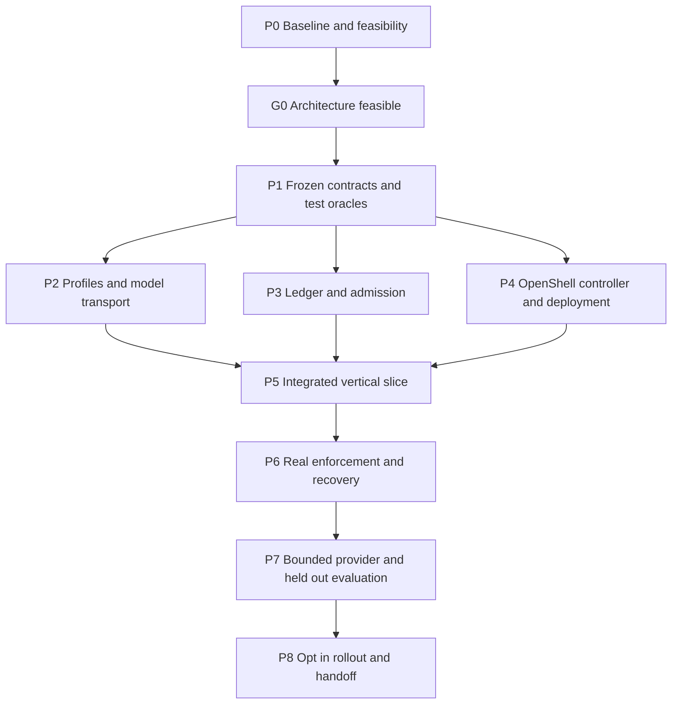

# Credential broker implementation and testing plan

Status: Implementation in progress; G0/G1 passed; P2–P5 implemented; P6 qualification running
Date: 2026-10-01
Plan version: 0.1.3
Design baseline: [Credential brokering specification version 0.2.3](../CREDENTIAL_BROKER_SPEC.md)

Implement one OpenAI-compatible backend through a minimal isolated inference executor, preserve existing tool and probe boundaries, and prove fail-closed behavior before using real provider credentials. Work proceeds through small reviewable changes with bounded parallel delegation. The original planning review did not run infrastructure, inference, or recovery tests. P0 has now run: the actual OpenShell Landlock qualification failed under the unchanged runsc daemon. See [feasibility evidence](../validation/OPENSHELL_FEASIBILITY.md) and [the proposed deployment revision](OPENSHELL_DEPLOYMENT_REVISION.md). The corrected dedicated-daemon G0 passed independent review for the bounded test prototype after actual confinement, substitution, admission, ledger-channel, egress, rotation, native gateway discovery, and cleanup observations. P1 is frozen in [protocol v1](CREDENTIAL_BROKER_PROTOCOL.md). P2–P5 source integration and deterministic tests are implemented; real P6 service/native/recovery qualification is running. P7 remains blocked on a separately recorded provider experiment budget, and P8 rollout remains disabled. Current evidence is tracked in [the implementation record](../validation/CREDENTIAL_BROKER_IMPLEMENTATION.md). Native gateway rediscovery does not establish future harness-controller or ledger recovery. The retained intermittent primary Docker OOM notification failure remains a qualification risk.

## Scope and completion criteria

The initial release includes explicit direct/brokered transport selection, one shared `inference-only` access profile mapped to all eleven registered agents, lazy executor creation by run and complete resolved contract, authenticated admission, bounded dispatch accounting, a durable request ledger, lease cleanup, provenance, and local/Temporal/eval parity. Different agent contracts must resolve to different executor sandboxes. One reviewed built-in OpenShell credential driver is sufficient. Middleware bindings start empty.

Do not implement private checkout, registry authentication, Bedrock brokering, streaming, cross-run pooling, policy inheritance, custom credential drivers, content inspection services, general API access, a new frontend, or automatic policy expansion. Credential driver and inspection extension configuration must remain possible through OpenShell's native mechanisms. A configured but unsupported required extension fails validation; it does not silently disappear.

Initial acceptance requires every applicable deterministic, real enforcement, recovery, provider, and evaluation gate below to pass. Missing runtime access produces `not_checked`, not acceptance. Rollout remains opt-in and cannot automatically fall back to direct access. Implementers use the repository's harness-change skill for behavior changes and harness-eval-experiment skill for controlled comparisons; neither skill authorizes paid inference outside a separately recorded budget.

## Team structure and cost controls

Use one lead and at most three concurrent sub-agents, matching the available four-agent execution capacity. Parallelize independent files and independent evidence collection, not shared mutable runtime state. The lead owns the final security and durability conclusions.

| Role | Suitable work | Model selection and review |
| --- | --- | --- |
| Lead integrator | Freeze contracts; choose auth boundary; map reservations; design retry and unknown-completion behavior; integrate existing model and workflow code; review all enforcement evidence | Use the main capable model. Do not delegate final safety or replay decisions to a cheaper model |
| Security and deployment implementer | Pinned OpenShell feasibility, effective policy verification, controller lifecycle, restricted service channels | Use a capable coding agent for unfamiliar isolation/auth changes; bounded task and lead review |
| Durability implementer | Ledger transactions, ownership, concurrency, migrations, crash recovery | Use a capable coding agent. Require independent tests and lead review of state transitions |
| Bounded support implementer | Frozen-schema config validation, deterministic mock upstream, golden fixtures, packaging checks, documentation, report assembly | Use an available lower-cost model, such as the local runtime's `gpt-6-luna` option, with a narrow context and explicit expected behavior. This is a routing recommendation, not a measured price claim |

Roles are assignments, not permanent additional agents. Rotate the third sub-agent slot between support, transport, and independent test work as dependencies clear. Begin with a small task on a cheaper agent; escalate once when reasoning exceeds its scope rather than repeatedly asking it to patch an unsafe design. Auth, TLS, ledger races, crash windows, Temporal history compatibility, and budget correctness require a capable owner even if support agents implement test cases.

Every delegated task must contain: objective; frozen interface revision; read paths; exclusive write paths; independent expected outcomes; focused checks; prohibited changes; and required completion evidence. Use fresh, narrow context for cheap agents. Ask for paths and decisions, not whole-file dumps. Sub-agents must not edit golden outcomes to match a candidate, weaken expected isolation, introduce live credentials, or dispatch paid evals without the lead's recorded authorization.

Do not run multiple exploratory implementations of the same adapter. Prefer one vertical slice, reusable fixtures, short completion reports, and a single integration owner. Record model identity and token/cost usage where exposed; leave unavailable cost unknown. No dollar savings are assumed. Measure total planning/implementation usage and rework to assess whether cheaper delegation was beneficial.

## Dependency schedule



Do not estimate a delivery date before P0. Its feasibility outcome may change the adapter design. The implementation branch starts from remote `develop` at `51fe66eb7459ce8f75a0d73931cf85867b78cefc`, whose tests still use a flat `tests/` layout. Paths in this copy follow that baseline rather than importing the unrelated local reorganization. After P1, estimate each package from the accepted interface and fixture scope. The critical path is feasibility, frozen contract, durable vertical slice, real enforcement/recovery, then provider acceptance. Fixture authoring and isolated module work can overlap; a shared VM, migrations, generated output, and final integration must have one owner at a time.

## P0 Establish baseline and prove feasibility

The lead records checkout HEAD, working-tree diff identity, current dependency lock, agent registry, model contracts, migration head, and generated-source conventions. Existing work is substantial and must not be overwritten, reset, or treated as part of this change. Recheck moved test and documentation paths. Use an isolated branch/worktree at the agreed baseline if that simplifies separation; preserve any required uncommitted baseline changes explicitly rather than assuming a new worktree contains them.

Run relevant baseline checks once and record pre-existing failures and skipped service tests. Baseline check failures are not permission to weaken expectations. The lead owns `agents/models.py`, `agents/registry.py`, workflow accounting, and shared configuration until assignments below transfer specific paths.

In parallel, assign the security implementer a pinned OpenShell spike and the support implementer a mock HTTPS upstream and fixture inventory. The spike must demonstrate:

1. A reviewed release/SDK/image pin and verified download identity in the checkout-owned Linux environment.
2. A minimal executor sandbox that receives only a placeholder and successfully calls the mock provider through substitution.
3. Authenticated worker-to-executor ingress and a narrow executor-to-controller ledger channel without admin APIs, host mounts, Docker sockets, or broad database credentials in the executor.
4. Effective policy inspection after provider composition and global selection; exact endpoint authorization in enforce mode; direct-egress denial.
5. Credential detach, new-process rotation, executor deletion, controller restart discovery, and cleanup scoped to this checkout.
6. Preservation of existing runsc build/probe isolation. Prove the executor's selected isolation boundary separately; any inability to provide the required executor confinement is a stop condition, not an insecure runtime fallback.

Use test-only secrets and a local mock upstream, not real model keys. Introduce a proposed opt-in setup mode only after checking the launcher's existing profile contract; `./dev --profile openshell` is not an existing command and must not be advertised until implemented. No global installations, context changes, or implicit VM/data resets.

**G0 exit:** an evidence record identifies exact topology, auth mechanism, isolation results, and required upstream APIs. All six capabilities have observable results. If authenticated ingress or restricted ledger access is impossible under the required boundary, stop the OpenShell implementation branch and propose a revised design. Continue only unaffected fixture/documentation work. Do not silently substitute a different broker.

## P1 Freeze contracts before parallel coding

The lead and capable reviewers settle these decisions in one small contract change before dependent implementations start:

- Strict request/response/error schemas and supported PydanticAI message parts. Unknown fields, remote content fetches, arbitrary URLs/headers, and streaming are rejected initially.
- Canonical request digest, complete executor contract digest, agent/profile mapping identity, and operational credential revision. Retry attempt numbers do not create a new logical request or bypass deduplication.
- Stable model request IDs derived from durable invocation identity and request ordinal. Cache construction or import-time resolution must not provision an executor or hold per-run credentials. Current model factory caching requires an explicit review so run-specific state cannot leak between runs.
- Authenticated worker identity, controller-issued reservation binding, expiry/deadline checks, run/agent/profile ownership, and minimum required executor service channels.
- Admission, dispatch-intent, result commit, unknown completion, and recovery transitions. Specify which actor may update each ledger field. Persisting a dispatch intent precedes upstream send; record transactions and race handling explicitly.
- Reservation accounting for all actual dispatches, unknown spend, provider usage, cancellation, and explicit replacement attempts. A single authoritative root ceiling must be consumed atomically across concurrent executors; per-executor limits alone are insufficient. No automatic executor-to-provider retry in the initial milestone.
- A minimal trusted recovery operation for replacing an unknown-completion request. It records the operator/controller authorization, original logical request, potential spend, new request identity, and fresh reservation. Agent output cannot authorize replacement. If this operation is deferred, initial recovery must stop explicitly rather than resend.
- Non-retryable policy/auth/identity errors versus bounded pre-dispatch infrastructure errors; map them to Temporal and local semantics without causing unknown completion to trigger a new dispatch.
- Native credential-driver deployment seam and empty middleware binding schema. Keep disabled extension status explicit; required unsupported extensions fail closed.

Independent test authors write outcome tables before the implementation. A hard timeout or process kill immediately before/after a write is a fixture, not a sleep-based race guess. Expose private test-only fault points or inject dependencies; never enable an unauthenticated production fault endpoint.

Resolve two terminology details at this gate: deny undeclared internal destinations while permitting only the reviewed authenticated service channels; identify provider attachment by its stable approved logical binding, with credential rotation revisions recorded separately. Rotation still creates a new process/executor. Neither clarification allows broader endpoint access.

**G1 exit:** reviewed schema fixtures, ledger transition table, reservation mapping, failure matrix, and interface ownership exist. The provisional module layout below may be renamed at this gate, then must remain stable during parallel work. Revise the design spec if the chosen mechanism changes a contract; do not bury decisions in adapter code.

## P2 P3 and P4 Parallel implementation lanes

Use one new package, provisionally `src/infosec_harness/inference/`, with a small controller service that owns the ledger. Do not deploy separate policy, lease, reservation, and ledger microservices. Reuse existing database/migration infrastructure when it can satisfy the reviewed trust boundary. The executor accesses a restricted controller API, not the database directly.

| Lane | Exclusive primary paths | Dependencies and deliverables |
| --- | --- | --- |
| P2 Profiles and transport | New `inference/profiles.py`, `inference/transport.py`, profile catalog under packaged config; `tests/test_broker_profiles.py`, `test_broker_transport.py` | After G1: complete agent mapping, strict configuration, typed message round-trip, effective settings applied once, response/error translation, direct-mode compatibility; lead performs shared model factory and registry edits |
| P3 Ledger and admission | New `inference/ledger.py`, `inference/admission.py`; ledger data models and one assigned migration; `tests/test_inference_ledger.py`, `tests/test_broker_admission.py` | After G1: transactional uniqueness and ownership, dispatch accounting, bounded state transitions, durable responses, explicit unknown completion, idempotent cleanup records; capable owner |
| P4 OpenShell adapter | New `inference/openshell.py`, `inference/controller.py`, executor service/entrypoint, isolated deployment files and narrow setup script; corresponding `tests/test_openshell_controller.py` | After G0/G1: controller lifecycle, authenticated endpoints, SDK operations, policy/attachment readiness, rotation/revocation, lazy instance allocation, lease reconciliation; capable owner |

Only the lead edits the shared protocol module once G1 is frozen. Lanes propose interface changes to the lead instead of changing each other's files. The lead also owns `settings.py`, `pyproject.toml`, `uv.lock`, `tests/conftest.py`, `justfile`, existing Compose files, agent integration, workflow modules, provenance, and generated sources. A lane needing shared fixtures adds a local fixture module until the lead deliberately consolidates it.

Use the lower-cost support agent for P2 pure config checks, independent message fixtures, mock upstream behavior, and packaging checks. A capable reviewer must validate custom PydanticAI model integration and response handling. P3 and P4 require capable owners. Do not grant additional paid provider authority merely because an agent needs to investigate a failure.

Each lane runs its focused tests and lint, reports actual results, and supplies small integration notes. The lead integrates one lane at a time and reruns affected boundaries. Do not run governance generators in parallel or assign overlapping migration revisions; allocate the next revision from the actual head at merge time.

## P5 Integrate one complete vertical slice

The lead routes one real harness model request through the broker transport to the deterministic HTTPS upstream. Keep tools on the worker; validate a returned tool call and structured output through the existing agent machinery. Wire agent/profile binding, reservation, controller provisioning, ledger, model response, accounting settlement, and provenance together for local execution, then Temporal execution, then eval execution.

Reuse executors only for the same run and identical full contract. Demonstrate a different `verdict` test profile allocating a distinct sandbox without changing other agents; restore the initial shared profile for the release. No two agents receive a union of privileges. Do not use middleware or secret-driver changes to exercise this test; narrower endpoint policy is sufficient.

The lead changes effective model/agent versioning and persistence through canonical sources. Additive migrations preserve existing runs; legacy provenance remains unverified. Runtime-observed policy and image identity must be corroborated by the controller. Complete records omit secret values, opaque credential placeholders, auth material, and secret-derived digests. Operational driver/credential revision changes stay separate from behavioral comparison identity.

**G2 exit:** a deterministic end-to-end slice passes for local, Temporal-backed, and eval paths; direct mode still works when explicitly selected; broker failure never selects direct mode; ledger accounting matches counted upstream dispatches. Passing this gate does not establish live OpenShell or real-provider acceptance.

## P6 Testing layers and independent expectations

| Layer | Execution environment | What a pass establishes |
| --- | --- | --- |
| A Deterministic | Stub/mock models; injected SDK/control plane; temporary databases and fake clock | Schemas, logic, parity fixtures, failure classes, ledger transactions, routing, budget invariants |
| B Service integration | Real HTTP/TLS executor and controller processes, mock HTTPS provider, real supported database | Channel auth, serialization, process crashes, ledger persistence and concurrent dispatch behavior |
| C OpenShell enforcement | Pinned real OpenShell sandbox/proxy in managed Linux environment; mock HTTPS provider | Actual credential substitution, effective policy, TLS validation, egress confinement, rotation/revocation and lifecycle |
| D Temporal recovery | Real Temporal service and workers; real controller/executor; mock provider; real OpenShell for final integrated recovery | Activity retry/cancellation, restart and history replay behavior under the intended topology |
| E Provider and held-out eval | One approved real backend; frozen datasets and limits; separate direct and brokered runs | Provider compatibility, observed usage/cost, added latency, quality and production/eval parity |

Run A/B first. Most C/D checks require no paid inference. E begins only after C/D pass and an explicit experiment budget is recorded. Existing `just test` selects stub model mode, but some Temporal tests run when a CLI is installed; its green summary is not proof that every service-dependent test executed. Count skipped tests and identify which gates they leave `not_checked`.

### Deterministic and protocol cases

Test positive and negative cases using independently specified inputs and counted provider sends:

- All eleven registered agents resolve; newly registered unknown agents, missing mappings, unsupported backend/profile pairs, extra fields, arbitrary endpoint/header choices, remote content, and streaming fail before dispatch.
- Auth failures, expired reservations, forged agent/profile identity, cross-run requests, changed digest with reused request ID, zero remaining budget, and expired deadlines cause zero upstream sends.
- Concurrent requests across different executors cannot exceed the authoritative root reservation. Test credential expiry, worker-channel identity expiry, and reservation expiry independently; they must not be conflated into one generic timeout fixture.
- Supported message/tool/output schemas, error responses, usage/cache fields, output floors, and merged system messages preserve existing semantics. Adaptations run exactly once. Invalid provider responses remain invalid and cannot execute tools directly.
- Logical request identity survives activity retries and worker restarts. Repeated requests attach to one operation; the same ID with a different payload conflicts. Distinct requests remain distinct even when their prompts are equal.
- Identical contracts share an executor only within their run; different profiles/images/model admission never share. Per-invocation accounting remains separate. Model client caches never carry one run's binding into another.
- Empty inspection bindings report disabled; unsupported required bindings fail before dispatch. Direct mode has no broker dependency. Brokered mode rejects direct key configuration and cannot discover ambient provider keys.

### Transaction and crash matrix

Run concurrency checks against every supported ledger database, including PostgreSQL before production acceptance; SQLite alone does not establish PostgreSQL transaction semantics. Use deterministic barriers and abrupt process termination, not only raised exceptions in one process.

| Fault point | Independent expected outcome |
| --- | --- |
| Before admission commit | Retry may admit once; no upstream send occurred |
| After accepted commit, before dispatch intent | Recover accepted record; one winning dispatch transition |
| Concurrent duplicates at dispatch intent | One winner; others wait or retrieve; no second send |
| After dispatch intent, before/after provider receives request | Missing durable result becomes unknown; no automatic resend, even if the test observer knows send did not occur |
| After provider response, before result commit | Unknown completion and reserved possible spend; no fabricated successful response |
| After result commit, before worker acknowledgement | Retry receives the saved result; upstream count remains one |
| After worker acknowledgement, before Temporal completion | Model activity retry recovers the same result; reservation settles once |
| Controller/executor restart with existing lease | Reconcile correct owner and contract; no unrelated sandbox deletion |
| Cancel or revoke at each state | Stop new admission, retain accurate dispatch disposition, clean up idempotently; do not claim upstream cancellation |
| Ledger retention expired | Explicit recovery failure; no silent fresh provider request |

If provider-supported idempotency is added later, give it a separate tested capability contract. Never infer exactly-once completion from a successful cancellation call or a ledger state alone.

### Live policy and credential cases

At the mock upstream, count every received connection/request and verify the canary real secret appears only in the approved authorization location. Collect worker and executor environments, errors, logs, traces, history exports, ledger records, artifact outputs, and relevant image layers; scan for canary secrets and placeholders without printing matched values into test output. Include an intentional leakage fixture to prove the detector can fail. Scanner absence of matches alone is insufficient; successful upstream substitution is the positive control.

Exercise wrong host/port/path/method/authority, malformed/expired/unattached placeholders, path normalization, alternate IP literals, redirects, IPv4/IPv6, metadata destinations, undeclared internal destinations, raw sockets, ignored proxy variables, and changing DNS resolution. For allow cases, observe the mock upstream request. For deny cases, require zero forbidden upstream requests; a timeout alone is not evidence of a policy denial.

Verify bad upstream certificates are rejected, client CA configuration works, and TLS bypass/audit mode/global overrides/provider-contributed broader rules fail readiness. Test credential rotation with a new process, expired credentials, provider detach acknowledgement, and controller loss during revocation. Rerun existing actual runsc and build-egress fixtures and demonstrate probes have no provider attachments or external route.

### Temporal and replay cases

Use real history exports from pre-change workflows and from the new brokered slice. Replay completed histories with controller/provider calls configured to fail if invoked. The expected result is zero replay-time I/O. Exercise active old histories under the selected Temporal compatibility mechanism; import-time config changes cannot silently switch their transport.

Kill a worker during a model activity and restart it with the same recorded contract. Verify saved results recover, pre-dispatch failures use bounded retries, policy failures are non-retryable, and unknown completion does not dispatch again. Cancel during admission, dispatch, and result delivery; inspect both workflow status and ledger/lease disposition. Repeat with rotated credentials under the same access contract and with a changed profile that must reject recovery.

**G3 exit:** layers A-D pass with real process and control-plane evidence; every spec acceptance row has named cases and retained results. A capable reviewer independent of the implementation checks auth, policy composition, retry multiplication, duplicate billing windows, and cleanup ownership. Optional prover or structured-event integrations may supply additional evidence but are not new initial-release dependencies.

## P7 Provider validation and performance budget

Before paid calls, freeze and record: backend/model/price identity; direct baseline and broker candidate versions; dataset/case IDs; allowed source-data scope; effective settings; calls per case; maximum requests, tokens, spend, wall time, and concurrency; unknown-cost reserve; abort conditions; and quality/performance thresholds. An unset spend ceiling blocks the paid phase. This plan is not a spending authorization.

First run a minimal live compatibility smoke with one approved backend, then a small paired evaluation, then a held-out evaluation if earlier results justify it. Sequential direct/brokered runs avoid contention and make accounting easier. Keep identical prompts, model settings, tools, retries, datasets, and scoring; retain all failed and uncertain attempts. Use the same transport configuration for production and evals. No prompt tuning or dataset relabeling within this transport comparison.

Record cold startup separately from warm request overhead, median/p95 request latency, total end-to-end triage time, executor count, memory/CPU, ledger overhead, actual dispatches, observed usage, unknown completion, and total billed cost when available. The small pilot estimates variance; choose the held-out sample and precision target before running it. Do not claim statistical parity from a tiny smoke. Existing correctness and safety thresholds cannot be relaxed for transport adoption.

**G4 exit:** provider compatibility, accounting, held-out quality, and preregistered operational limits pass. Any safety regression stops rollout. A cost or latency regression is reported against the frozen threshold rather than hidden by dropping cold starts or failed runs.

## Commands and gate execution

Existing commands run from the checkout root. New filenames below are planned tests, not current executable targets.

```bash
HARNESS_MODEL_MODE=stub uv run pytest tests/test_broker_profiles.py tests/test_broker_transport.py
HARNESS_MODEL_MODE=stub uv run pytest tests/test_inference_ledger.py tests/test_broker_admission.py tests/test_openshell_controller.py
HARNESS_MODEL_MODE=stub uv run pytest tests/test_model_backends.py tests/test_retry_bounds.py tests/test_root_budgets.py tests/test_migrations.py
just check
just test
just generated-check
just dev-skills-check
./dev doctor
./dev smoke
```

The deployment package must add an explicit broker enforcement/recovery runner after its topology is established. It must validate required services and fail when required fixtures cannot execute, rather than skip them and report success. Proposed marker names or setup commands must be registered and documented before use; the current pytest configuration has no custom markers. Reports separate mock, real OpenShell, real Temporal, and real-provider results.

Run focused checks after each change and the full gates after integration. Repeat only affected checks following fixes. `just ui-check` is `not_applicable` unless frontend files change; UI work is deferred. Installed-wheel/package tests must verify runtime catalogs, executor entrypoints, and migrations work outside the checkout. Run governance/schema generators only when their canonical inputs change, and have one integration owner inspect generated diffs. `just generated-sync` does not regenerate all governance or API artifacts.

## Reviewable changes and handoff

| Change | Review boundary |
| --- | --- |
| 1 Feasibility evidence and pins | G0 topology, risks, unsupported behavior; no production routing |
| 2 Protocol and profiles | G1 contracts, full agent mappings, negative validation fixtures |
| 3 Ledger and authenticated admission | Atomic state transitions, budget authority, ownership and migrations |
| 4 Executor and OpenShell controller | Auth/service topology, enforcement, lifecycle, secret handling |
| 5 Harness integration and provenance | Local/Temporal/eval parity, old-history compatibility, no fallback |
| 6 Live acceptance and rollout docs | G3/G4 evidence, operational commands, cleanup/recovery runbook |

Each change reports affected contracts, risk, behavior/provenance versions, replay/recovery assessment, and every relevant gate as `passed`, `failed`, `not_checked`, or justified `not_applicable`. Keep evidence under `docs/validation/`; transient logs/reports go beneath `.harness/reports/credential-broker/` with unique run IDs. Sanitized records include code/diff identity, dependency and image pins, actual policy digests, commands, executed/skipped case counts, dispatch counts, database/Temporal topology, and remaining gaps. Do not publish keys, placeholders, auth certificates, or source-bearing request bodies.

The runbook must cover broker readiness, rotation, expired credentials, unknown completion, revocation failure, controller/worker restart, ledger retention, cancellation, orphan cleanup, and explicit rollback. Rollback drains/reconciles brokered operations and revokes their leases; direct mode is an explicit choice for new runs, not recovery fallback. Preserve existing VM/data and completed evidence.

## Deferred packages and original planning evidence

Credential-driver migration and content inspection are independent follow-up packages after the first release. Driver work rechecks secret storage, attachment, rotation, revocation, and recovery. Inspection work adds native middleware, explicit coverage/failure policy, false-positive fixtures using real vulnerability payloads, behavioral provenance, and paired evals. Private checkout, registries, and Bedrock each retain their separate live acceptance requirements from the design spec.

The following table is the retained pre-implementation planning checkpoint. Current source
and qualification outcomes are in the implementation record linked above.

| Original planning gate | Status | Basis |
| --- | --- | --- |
| Spec and repository interface review | passed | Reviewed version 0.2.0, registered agents, current baseline tests, migration and generator conventions |
| Parallel planning review | passed | Separate implementation and test planning reviews; bounded inventory delegated to a lower-cost agent |
| Document integrity | passed | Local links, code fences, and patch whitespace checked after authoring |
| Initial topology G0 | failed | Actual Landlock qualification failed under runsc; see linked feasibility evidence |
| Dependent implementation and gates G1 to G4 | not_checked | Blocked at G0; no production brokering enabled |
| Runtime/schema/generated changes | not_applicable | No broker runtime/schema changes; P0 tooling and a baseline dependency correction are recorded separately |
