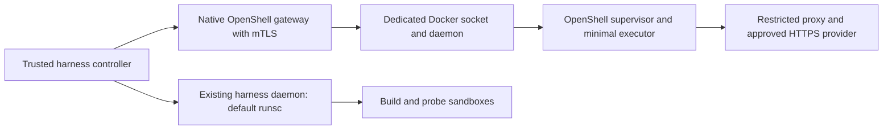

# Proposed OpenShell deployment revision

Date: 2026-10-01
Status: Proposed after failed G0; not implemented or accepted
Applies to: [implementation plan](CREDENTIAL_BROKER_IMPLEMENTATION_PLAN.md)
Evidence: [actual feasibility result](../validation/OPENSHELL_FEASIBILITY.md)

OpenShell v0.1.2 cannot pass its Landlock qualification under the harness's
managed daemon default, `runsc`. Its Docker driver offers no supported runtime
selector. The smallest proposed deployment change is a separate checkout-owned
Docker daemon in the managed Linux VM, used exclusively by the trusted OpenShell
gateway. The harness daemon keeps its existing runsc default and sandbox checks.

This proposal does not approve runc as an equivalent security boundary. The
OpenShell supervisor must independently demonstrate its native Landlock,
seccomp-notify, filesystem, process, and network confinement. Until then the
new daemon cannot host an accepted credential-bearing executor.

## Concrete ownership and configuration

- Provision the additional daemon only inside the checkout-owned Linux VM. Use
  its existing checksum-verified Docker/runc binaries. Create an isolated data
  root, execution root, containerd state/socket/plugin metadata, daemon configuration, PID file,
  Unix socket, bridge name, and non-overlapping
  address range. Validate absence of collisions before starting; do not kill or
  reconfigure another daemon to make startup succeed.
- Store lifecycle metadata and reviewed configuration under `.harness/openshell/`.
  Socket and execution paths must use a native guest filesystem, rather than
  relying on socket support in the macOS shared filesystem. Derive guest state
  directories from the checkout identity, keep permissions restricted, and record
  the exact paths. Do not overwrite `HOME` or `CODEX_HOME`.
- The dedicated daemon uses native runc for compatibility with the OpenShell
  boundary. The gateway's documented `socket_path` points only to that daemon.
  No TCP Docker API listener and no host Docker context switch are introduced.
  Do not mount either daemon socket into the inference executor.
- The native gateway runs as a trusted control-plane process in the guest. It has
  daemon authority and opaque credential storage; agents and repository tools do
  not. Configure TLS and mTLS explicitly, disable loopback service plaintext,
  pin binary and image identities, and retain manual policy approval.
- Keep gateway, mock HTTPS upstream, and controller ports distinct from the
  harness stack. Allow only reviewed application channels; authentication to
  the gateway does not replace signed executor admission. OpenShell strips
  forwarded `Authorization`, so the executor needs a separate reviewed header
  for its signed request/reservation identity.
- The controller's ledger channel must use an exact reviewed hostname/private
  address, HTTPS, exact allowed methods/paths, and run-scoped authorization.
  Host loopback is not an assumed allowed external destination. No worker
  credential or database authority is supplied to the executor.
- No general privileged executor containers, extra agent-visible mounts,
  network bypass, TLS skipping, audit-only enforcement, or fallback to the
  direct provider path may compensate for qualification failure.

This creates one additional daemon, not separate policy, admission, lease, or
ledger services. The original controller/executor architecture, one initial
shared profile, per-contract sandboxes, and deferred native extension seams
remain as specified. If maintaining two daemon lifecycles is unacceptable,
use a separately qualified supported compute backend in a later revision;
maintaining an upstream driver patch is a larger compatibility commitment.

## Required prototype and acceptance

1. Freeze the complete native gateway/driver/sandbox/image identities and exact
   daemon paths before deployment. Prove both daemons' selected sockets and
   runtime configuration through independent observations.
2. Start the dedicated daemon and native gateway without touching the harness
   daemon. Prove a provider-free OpenShell executor reaches Ready and runs a
   counted marker. Merely returning zero from `sandbox create` is insufficient.
3. With test-only credentials, prove upstream substitution and zero forbidden
   requests; verify effective policy after provider composition, TLS rejection,
   and REST enforce mode. Retain filesystem/process/egress allow and deny controls.
4. Demonstrate authenticated worker-to-executor admission and the restricted
   executor-to-ledger channel in the intended topology. No request body or prompt
   may choose a different endpoint, profile, authorization, or budget authority.
5. Exercise detach, new-process rotation, deletion, gateway restart discovery,
   controller loss, and owned orphan cleanup. Verify observed cleanup completion
   rather than accepting an asynchronous delete acknowledgement.
6. Run the existing real runsc and build-egress acceptance runner against the
   original harness socket, then repeat after the OpenShell spike. A network
   rule or Docker default change must not alter build/probe behavior. Record
   guest firewall/iptables rules and forwarding sysctls before and after both
   daemon start and stop. Abort if harness egress controls change; both
   daemons share the VM kernel and firewall, so socket separation alone does not
   establish independent egress boundaries.
7. Stop only the additional owned processes and clean up owned fixtures. Preserve
   both daemons' data and evidence unless explicitly reset. Confirm other
   checkouts and completed harness runs remain usable.

All six original G0 capabilities must then pass. Only after that review may
P1 freeze the protocol and the P2/P3/P4 implementation lanes begin. The failed
runsc experiment remains an explicit unsupported-topology case, not a weakened
expected outcome. No production compatibility or confidentiality claim follows
from this proposal.

## Review and remaining authorization

The plan says executor confinement failure is a stop condition. This document
makes the replacement topology reviewable before asking to broaden deployment.
The requested `feature/openshell` branch exists locally, but the integration is
not complete; the completed implementation push and PR against `develop` remain
pending. Real-provider evaluation also needs a separately recorded backend/model
and maximum-spend budget before any paid calls.
