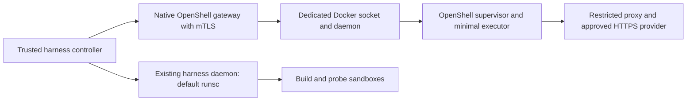

# Proposed OpenShell deployment revision

Date: 2026-10-01
Status: User-approved deployment revision; bounded G0 feasibility approved; production contracts next
Applies to: [implementation plan](CREDENTIAL_BROKER_IMPLEMENTATION_PLAN.md)
Evidence: [actual feasibility result](../validation/OPENSHELL_FEASIBILITY.md)

OpenShell v0.1.2 cannot pass its Landlock qualification under the harness's
managed daemon default, `runsc`. Its Docker driver offers no supported runtime
selector. The approved deployment change is a separate checkout-owned
Docker daemon in the managed Linux VM, used exclusively by the trusted OpenShell
gateway. The harness daemon keeps its existing runsc default and sandbox checks.

This revision does not treat runc alone as an equivalent security boundary.
G0 evidence records the OpenShell supervisor's native Landlock, seccomp-notify,
filesystem, process, and network controls. Independent capable review approved
the bounded feasibility prototype after cleanup was repeated and verified;
production credential-bearing routing is not authorized by that approval.

## Concrete ownership and configuration

- Provision the additional daemon only inside the checkout-owned Linux VM. Use
  its existing checksum-verified Docker/runc binaries. Create an isolated data
  root, execution root, private containerd config/state/socket/plugin metadata,
  daemon configuration, PID file, and Unix socket. Give it a pre-created,
  checkout-named user bridge with the reviewed isolated subnet and address;
  do not set `bip`. Disable daemon iptables/ip6tables management, forwarding,
  and masquerading. Disable IPv6 only on this owned bridge before bringing it
  UP; do not change IPv6 state on the host or harness interfaces. The pinned
  OpenShell driver uses a host-network supervisor and does not require bridge
  NAT. Use the
  native guest private address for reviewed mock/ledger channels. Validate
  absence of socket/process collisions before starting; do not kill or
  reconfigure another daemon to make startup succeed.
- Store lifecycle metadata and reviewed configuration under `.harness/openshell/`.
  Socket and execution paths must use a native guest filesystem, rather than
  relying on socket support in the macOS shared filesystem. Derive guest state
  directories from the checkout identity, keep permissions restricted, and record
  the exact paths. Do not overwrite `HOME` or `CODEX_HOME`.
- The dedicated daemon uses native runc for compatibility with the OpenShell
  boundary. The gateway's documented `socket_path` points only to that daemon.
  No TCP Docker API listener and no host Docker context switch are introduced.
  Do not mount either daemon socket into the inference executor.
- The native gateway runs as a trusted control-plane process in the guest. It has
  daemon authority and opaque credential storage; agents and repository tools do
  not. Configure TLS and mTLS explicitly, disable loopback service plaintext,
  pin binary and image identities, and retain manual policy approval.
- Keep gateway, mock HTTPS upstream, and controller ports distinct from the
  harness stack. Allow only reviewed application channels; authentication to
  the gateway does not replace signed executor admission. OpenShell strips
  forwarded `Authorization`, so the executor needs a separate reviewed header
  for its signed request/reservation identity.
- The controller's ledger channel must use an exact reviewed hostname/private
  address, HTTPS, exact allowed methods/paths, and run-scoped authorization.
  Host loopback is not an assumed allowed external destination. No worker
  credential or database authority is supplied to the executor.
- No general privileged executor containers, extra agent-visible mounts,
  network bypass, TLS skipping, audit-only enforcement, or fallback to the
  direct provider path may compensate for qualification failure.

This creates one additional daemon, not separate policy, admission, lease, or
ledger services. The original controller/executor architecture, one initial
shared profile, per-contract sandboxes, and deferred native extension seams
remain as specified. If maintaining two daemon lifecycles is unacceptable,
use a separately qualified supported compute backend in a later revision;
maintaining an upstream driver patch is a larger compatibility commitment.

## Observed daemon-start correction (2026-10-01)

The first dedicated-daemon attempt used `bridge=none`. Docker 29.1.3 removed
the unused primary `docker0` bridge and its routes during startup; the owned
child container briefly started and then stopped. This is retained as a failed
attempt, not treated as evidence that disabling OpenShell's bridge is safe.
The lead restored the primary bridge with its observed MAC
`8e:c8:32:9d:57:04` and IPv4 `172.17.0.1/16`, then reran the actual runsc and
build-egress acceptance checks successfully.

The corrected daemon uses the pre-created named bridge `ihos0c3cae03c0`, subnet
`172.29.255.0/30`, address `172.29.255.1`, with `RA=0` and `UP` before the
startup firewall/routes snapshot. It has no `bip`; daemon iptables, ip6tables,
forwarding and masquerading are disabled. A private containerd config root,
state directory and socket are explicit because Docker otherwise reuses the
system containerd. Startup passed the shared-firewall, route and forwarding
invariant checks. At this checkpoint, the mTLS native gateway was running and
pointed at the separate socket
`/var/lib/ih-openshell/0c3cae03c0/run/docker.sock`; pinned images were loaded.
These checks establish daemon/gateway startup only. OpenShell sandbox
readiness, native confinement and credential substitution were still
`not_checked` at this daemon-start checkpoint; see the later G0 requalification
evidence for the subsequent observed outcomes.

### Owned-bridge IPv6/DAD amendment

The initial bridge setup added an owned local route after the first baseline
snapshot. Recovery preserved the original route and firewall state, asserted
all original routes and rules unchanged, and set `disable_ipv6` only for the
owned bridge before it was brought UP. No host-wide or harness-interface IPv6
setting was changed. The subsequent startup and stop checks passed with a stable
elapsed-window snapshot. The corrected original runsc and build-egress acceptance
also passed concurrently. An earlier concurrent memory failure exited 137 with
`OOM=false`: the kernel cgroup killed the process but Docker emitted no OOM
event. This intermittent notification gap remains unresolved; no code or expected
outcome was weakened to hide it.

## Required prototype and acceptance

1. Freeze the complete native gateway/driver/sandbox/image identities and exact
   daemon paths before deployment. Prove both daemons' selected sockets and
   runtime configuration through independent observations.
2. Start the dedicated daemon and native gateway without touching the harness
   daemon. Prove a provider-free OpenShell executor reaches Ready and runs a
   counted marker. Merely returning zero from `sandbox create` is insufficient.
3. With test-only credentials, prove upstream substitution and zero forbidden
   requests; verify effective policy after provider composition, TLS rejection,
   and REST enforce mode. Retain filesystem/process/egress allow and deny controls.
4. Demonstrate authenticated worker-to-executor admission and the restricted
   executor-to-ledger channel in the intended topology. No request body or prompt
   may choose a different endpoint, profile, authorization, or budget authority.
5. Exercise detach, new-process rotation, deletion, gateway restart discovery,
   and owned orphan cleanup. Verify observed cleanup completion rather than
   accepting an asynchronous delete acknowledgement. Controller-loss and
   harness-ledger recovery tests are deferred to P4/P6 and remain `not_checked`.
6. Run the existing real runsc and build-egress acceptance runner against the
   original harness socket, then repeat after the OpenShell spike. A network
   rule or Docker default change must not alter build/probe behavior. Record
   guest firewall/iptables rules and forwarding sysctls before and after both
   daemon start and stop. Abort if harness egress controls change; both
   daemons share the VM kernel and firewall, so socket separation alone does not
   establish independent egress boundaries.
7. Stop only the additional owned processes and clean up owned fixtures. Preserve
   both daemons' data and evidence unless explicitly reset. Confirm other
   checkouts and completed harness runs remain usable.

The bounded G0 feasibility prototype and its direct-egress allow/deny pair have
passed independent capable review. Cleanup was reverified: no native sandboxes
or dedicated-daemon containers remained, owned processes were stopped, and the
shared network snapshot remained unchanged. Production contracts and integration
are next; P1 protocol freeze and P2/P3/P4 implementation remain pending. The
failed runsc experiment remains an explicit unsupported-topology case, not a
weakened expected outcome. No production compatibility or confidentiality claim
follows from this evidence.

## Review and remaining authorization

The plan says executor confinement failure is a stop condition. This document
made the replacement topology reviewable. The user approved it on 2026-10-01;
independent capable review approved the bounded feasibility prototype. The
dedicated daemon, gateway, and fixture were used for the recorded tests and
stopped after repeated cleanup verification; their data and evidence were retained.
The requested `feature/openshell` branch exists locally, but the integration is
not complete; the completed implementation push and PR against `develop` remain
pending. Real-provider evaluation also needs a separately recorded backend/model
and maximum-spend budget before any paid calls.
